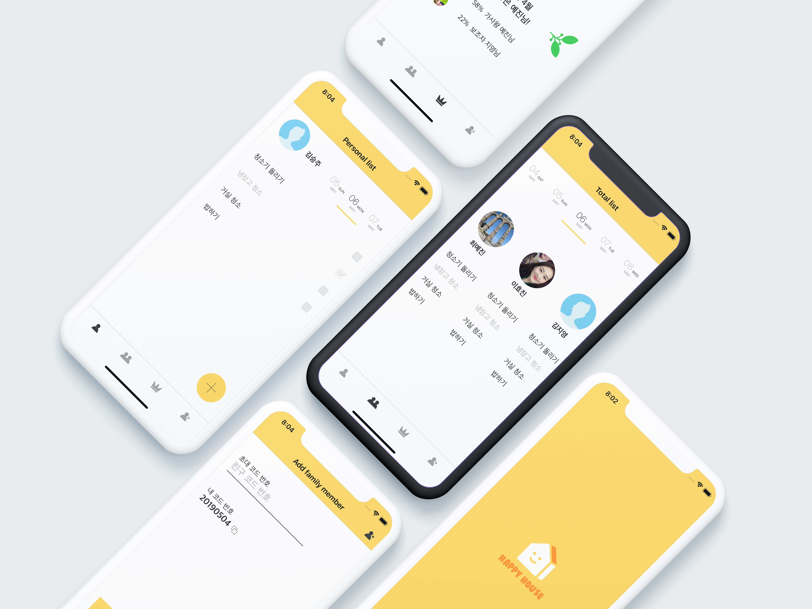

# 해피하우스 | happyhouse
> 사랑이 가득가득, 해피하우스

[![Swift Version][swift-image]][swift-url]
[![License][license-image]][license-url]
[](http://cocoapods.org/pods/LFAlertController)
[](http://makeapullrequest.com)



### 문제점, 현상황
소통의 부재와 불공정한 집안일 분할
분배한 일을 잊고 지나가버리는 상황

### 해결
분할 비율을 알려주는 것
팝업창으로 반복적인 알림을 통한 인지

### 목적 
해야할일을 잊지않고 “_”문득 떠올라 집안일을하는

### 가치 
공정한 집안 살림을 운용하기위한, 설득의 도구


## Features

- [x] 가족 멤버 추가
- [x] 내 집안일 등록
- [ ] 다른 멤버 집안일 및 진행상황 확인
- [x] 온보딩, 카카오 로그인
- [ ] 월별 / 주별 통계 기능

## Requirements

- iOS 12.1+
- Xcode 10.2.1

## Installation

#### Backend
백엔드 서버 배포 후 `Router.swift` 파일에서 address 업데이트 필요
> https://github.com/depromeet/Hackathon_Team1_backend

#### CocoaPods

```ruby
pod install
```

#### Firebase && Kakao login Setup
아래 2가지 설정 파일 제공
- happyhouse/Info.plist
- happyhouse/GoogleService-Info.plist 
 

## Contribute

We would love you for the contribution to **happyhouse**, check the ``LICENSE`` file for more info.

## Contributers
Designed and developed at Deproton 2019


### Designed by
- Jiyoung Kim - smile5602@naver.com
- Hyojin Lee - hyojin428@naver.com

### Developed by
- Yejin Choi - cyj95428@gmail.com
- SeungJu Kim – nicholaskim94@gmail.com


Distributed under the MIT license. See ``LICENSE`` for more information.

[swift-image]:https://img.shields.io/badge/swift-4.2-orange.svg
[swift-url]: https://swift.org/
[license-image]: https://img.shields.io/badge/License-MIT-blue.svg
[license-url]: LICENSE
[codebeat-image]: https://codebeat.co/badges/c19b47ea-2f9d-45df-8458-b2d952fe9dad
[codebeat-url]: https://codebeat.co/projects/github-com-vsouza-awesomeios-com